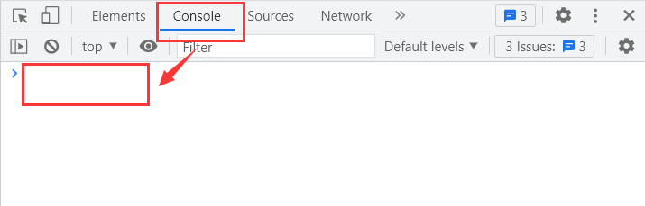

# 评教脚本

## `console` 面板



## 教材评价

* 在 **教材评价** 页面按 <kbd>F12</kbd>，切换到 `console` 面板；

* 在 `console` 面板中粘贴如下命令：

```js
document.querySelectorAll(".option-list").forEach((item) => { item.firstElementChild.firstElementChild.click(); });
```

* 按回车；
* 点击 `提交` 按钮。

## 学生评教

* 在 **学生评教** 页面按 <kbd>F12</kbd>，切换到 `console` 面板；
* 在 `console` 面板中粘贴如下命令：

```js
document.querySelectorAll("#evaIndex").forEach((item) => { item.click(); });
document.querySelector("#evaText").innerText = "感谢老师的用心备课，一学期的课程学到了很多，受益匪浅！";
```

* 按回车；
* 点击 `下一页` 按钮。